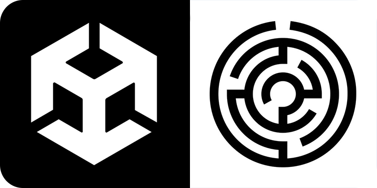
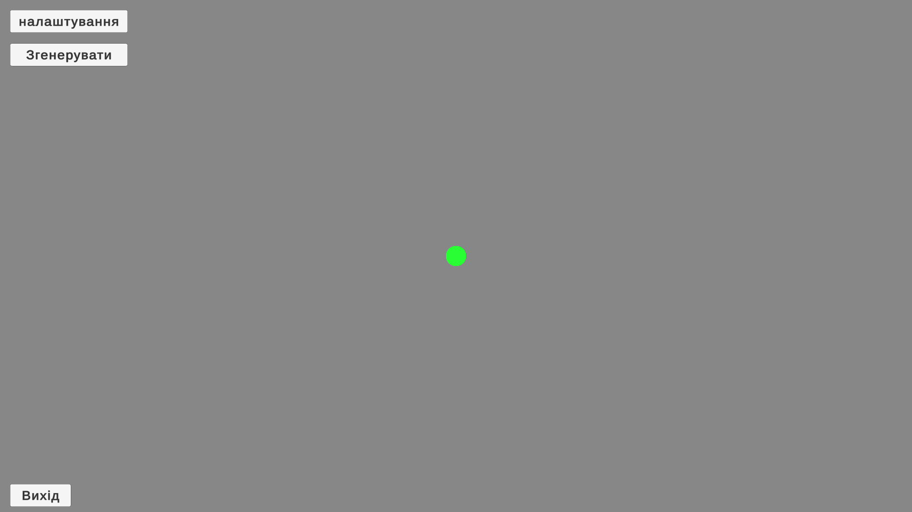
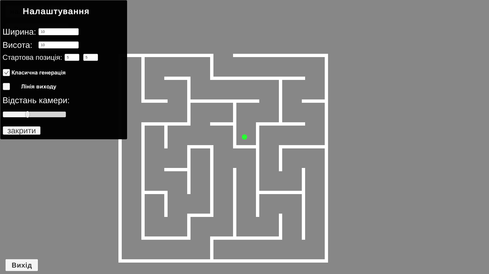
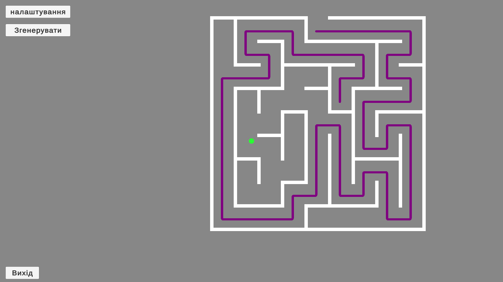

    <b align ="center"><h1 align ="center">Generation Maze</h1></b>

<h1 align="center">
   
   
   
</h1>

A simple algorithm for creating a maze in Unity. 
 

## Table of Contents
1. [Preview of work](#Preview-of-work)
2. [How to install](#How-to-install)
3. [Where take .exe file](#Where-take-exe-file)
4. [How to use](#How-to-use)

## <a name="Preview-of-work">Preview of work</a>

 Images

  

    

    

    

## <a name="How-to-install">How to install</a>
* Download project
* Open project in Unity
* Use project.

## <a name="Where-take-exe-file">Where take .exe file</a>
* Download project
* Find Build.zip
* Extract where you need
* Use .exe file

## <a name="How-to-use">How to use</a>
* There is a settings button at the top  
Here you can configure:
  * The size of the maze
  * The starting position of the player
  * The type of generation
  * Whether to show the exit line
  * The player's viewing distance
  * Exit from the settings.

* There is a button to generate a maze just below the settings
  * Generates a maze

* At the bottom is the button to exit the program

* Player movement is realized by arrows
